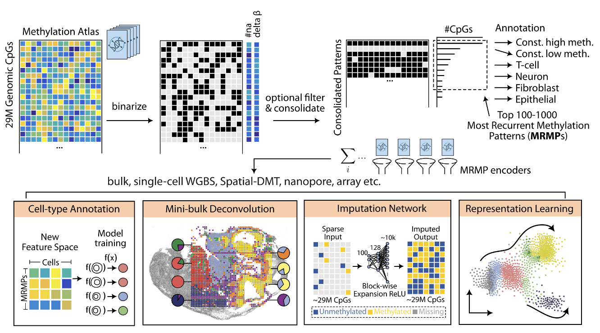

# MethScope

<p align="center">
  
</p>

**MethScope** is an R package for ultra-fast analysis of sparse DNA methylome data using **Most Recurrent Methylation Patterns (MRMPs)**.

It supports downstream analysis for:
- Cell type annotation
- Cell type deconvolution
- Unsupervised clustering
- Cancer cell-of-origin prediction
- Missing value imputation

## Why MethScope?

Sparse single-cell and spatial methylome data are often too sparse to analyze directly. MethScope compresses methylation signals into MRMP-based embeddings so you can run robust and scalable downstream tasks with standard analysis workflows.

## Method overview

<p align="center">
  
</p>

MethScope converts high-dimensional methylation atlas signals into compact MRMP features and applies these features across multiple analysis tasks.

Core workflow:
- Binarize methylation atlas profiles and consolidate recurrent patterns
- Select top recurrent methylation patterns (MRMPs)
- Encode each sample, cell, or pixel into an MRMP-based representation
- Run downstream modeling for annotation, deconvolution, imputation, and representation learning

Use cases supported in the current pipeline:
- Cell-type annotation in sparse single-cell methylome profiles
- Mini-bulk deconvolution for mixed-cell samples
- Missing-value imputation for sparse CpG measurements
- Representation learning for clustering and embedding analysis

## System Requirements

### Software Dependencies

- **R** >= 4.0 (tested on R 4.5.2 and R 4.6.0)
- **Operating systems tested**: macOS, Linux (Ubuntu)
- **System library**: `zlib`
- R package dependencies (installed automatically): `xgboost`, `dplyr`, `tidyr`, `stringr`, `caret`, `doParallel`, `parallel`, `ggplot2`, `uwot`, `magrittr`, `FNN`, `data.table`, `nnls`

### Hardware Requirements

No non-standard hardware is required. MethScope runs on a standard laptop or desktop CPU. No GPU is needed.

## Installation

Install from CRAN:

```r
install.packages("MethScope")
```

Or install the development version from GitHub:

```r
# install.packages("devtools")
devtools::install_github("zhou-lab/MethScope")
```

## Example Data

The GitHub repository includes a full example query file,
`inst/extdata/example.cg`, for testing MethScope end to end. After cloning this
repository, run the example from the repository root.

CRAN packages have size limits, so the CRAN release contains only tiny toy files.
Use the GitHub example data below for functional testing and cell-type
prediction.

GitHub reference `.cm` files are named by genome build and source dataset:

- `inst/extdata/mm10_Liu2021.cm`: mouse brain MRMP reference
- `inst/extdata/hg38_Zhou2025.cm`: human atlas MRMP reference
- `inst/extdata/hg38_Loyfer2023.cm`: human atlas MRMP reference from Loyfer et al.

## Quick Start

```r
library(MethScope)

# Run this from the root of a cloned zhou-lab/MethScope repository.
example_file      <- "inst/extdata/example.cg"
reference_pattern <- "inst/extdata/mm10_Liu2021.cm"

input_pattern <- GenerateInput(example_file, reference_pattern)

model <- Liu2021_MouseBrain_P1000()
prediction_result <- PredictCellType(model, input_pattern)

umap_plot <- PlotUMAP(input_pattern, prediction_result)
```

Expected output: a cell-by-MRMP matrix (`input_pattern`) and a data frame of
predicted cell type labels with confidence scores (`prediction_result`). The
full `mm10_Liu2021.cm` reference contains more than 1000 MRMPs; the built-in
mouse brain model uses the first 1000 patterns. The UMAP plot will display cells
colored by predicted cell type.

## Tutorials and documentation

- Documentation website: [zhou-lab.github.io/MethScope](https://zhou-lab.github.io/MethScope/)
- End-to-end tutorial: [MethScope-Tutorial](https://zhou-lab.github.io/MethScope/articles/MethScope-Tutorial.html)
- Building MRMP references: [MethScope-MRMP](https://zhou-lab.github.io/MethScope/articles/MethScope-MRMP.html)

## Agent skill

This repository includes a reusable MethScope agent skill under `agent-skills/methscope/`.

### Codex

Install the skill under `$CODEX_HOME/skills/methscope/` with this layout:

```text
$CODEX_HOME/skills/methscope/
  SKILL.md        <- copy from agent-skills/methscope/codex/SKILL.md
  core/
```

Copy:
- `agent-skills/methscope/codex/SKILL.md` to `$CODEX_HOME/skills/methscope/SKILL.md`
- `agent-skills/methscope/core/` to `$CODEX_HOME/skills/methscope/core/`

Then invoke the skill when working on MethScope package usage, vignettes, `.cg` and `.cm` inputs, MRMP embeddings, prediction, training, deconvolution, or visualization.

### Claude

If you already keep a repository-level `CLAUDE.md`, copy the contents of `agent-skills/methscope/claude/CLAUDE.md` into it or reference that file from your existing Claude project instructions.

If you do not already have a project `CLAUDE.md`, use `agent-skills/methscope/claude/CLAUDE.md` as the starting project context for this repository.

Keep `agent-skills/methscope/core/` in the repository, because the Claude instructions point to those shared files.

### Shared files

- `agent-skills/methscope/core/INSTRUCTIONS.md`
- `agent-skills/methscope/core/WORKFLOWS.md`
- `agent-skills/methscope/core/REFERENCES.md`

## Data resources

- Example `.cg`, `.cm`, and reference `.rds` files are bundled in `inst/extdata`
- `.cg` generation and preprocessing: [YAME](https://zhou-lab.github.io/YAME/)
- Pattern interpretation: [knowYourCG](https://www.bioconductor.org/packages/release/bioc/html/knowYourCG.html)

## License

This project is licensed under the [GNU Affero General Public License v3.0 (AGPL-3.0)](LICENSE.md).

Copyright (c) 2025 Hongxiang Fu and Wanding Zhou (zhouw3@chop.edu)

For commercial use or if the AGPL-3.0 restrictions are not suitable for your use case, please contact us for a commercial license: zhouw3@chop.edu

## Citation

If you use MethScope, please cite (coming soon):

Fu H*, Xu H*, Lee CN, Cloud C, Deng Y, Zhou W.
**MethScope: Ultra-Fast Analysis of Sparse DNA Methylome via Recurrent Pattern Encoding**.
