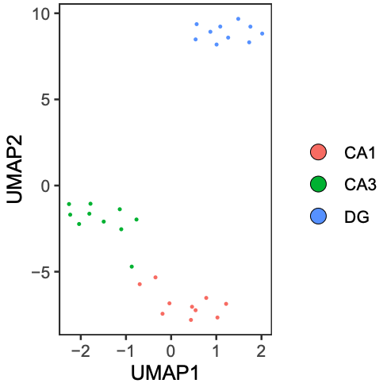
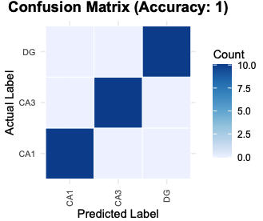
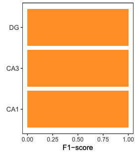

```{r, include = FALSE}
options(device = "png")
knitr::opts_chunk$set(
  fig.ext = "png",
  collapse = TRUE,
  comment = "#>"
)
```

```{r setup, warning=FALSE, message=FALSE}
library(MethScope)
```

## Overview

This tutorial demonstrates a standard MethScope workflow:

- Generate MRMP embeddings from `.cg` input
- Perform cell-type annotation with a pre-trained model
- Train a custom model
- Visualize prediction quality
- Run deconvolution and unsupervised clustering

Data and preprocessing resources:

- Example/reference data: <https://github.com/zhou-lab/methscope_data>
- Prepare MethScope input from BED, ALLC, beta/fraction, or binary tracks: <https://zhou-lab.github.io/MethScope/articles/MethScope-Input.html>
- Generate `.cg` input files: <https://zhou-lab.github.io/YAME/>
- Interpret MRMP patterns: <https://www.bioconductor.org/packages/release/bioc/html/knowYourCG.html>

## 1) Generate cell/pixel/sample MRMP embeddings

Use `GenerateInput()` to transform a query `.cg` file into a sample-by-MRMP matrix.

The GitHub repository includes a full example query file for testing MethScope.
After cloning <https://github.com/zhou-lab/MethScope>, run from the repository
root:

CRAN packages have size limits, so the CRAN release contains only tiny toy files.
Use the GitHub example data below for functional testing and cell-type
prediction.

GitHub reference `.cm` files are named by genome build and source dataset:
`mm10_Liu2021.cm`, `hg38_Zhou2025.cm`, and `hg38_Loyfer2023.cm`.

```{r, eval=FALSE}
# Paths to the GitHub example .cg file and mouse brain .cm reference
example_file <- "inst/extdata/example.cg"
reference_pattern <- "inst/extdata/mm10_Liu2021.cm"
input_pattern <- GenerateInput(example_file, reference_pattern)
```

The full `mm10_Liu2021.cm` reference contains more than 1000 MRMPs; the built-in
mouse brain model uses the first 1000 patterns.

Example output (`head(input_pattern[, 1:9])`):

| Sample     | P1    | P2    | P3    | P4    | P5    | P6    | P7    | P8    | P9    |
|------------|-------|-------|-------|-------|-------|-------|-------|-------|-------|
| GSM4012028 | 0.935 | 0.016 | 0.902 | 0.899 | 0.881 | 0.898 | 0.900 | 0.883 | 0.850 |
| GSM4014036 | 0.941 | 0.021 | 0.911 | 0.904 | 0.888 | 0.911 | 0.920 | 0.901 | 0.867 |
| GSM4014043 | 0.955 | 0.019 | 0.931 | 0.926 | 0.916 | 0.930 | 0.918 | 0.932 | 0.897 |
| GSM4014056 | 0.954 | 0.023 | 0.940 | 0.934 | 0.928 | 0.940 | 0.912 | 0.932 | 0.918 |
| GSM4014298 | 0.947 | 0.016 | 0.926 | 0.922 | 0.909 | 0.923 | 0.863 | 0.918 | 0.894 |
| GSM4016157 | 0.929 | 0.016 | 0.887 | 0.881 | 0.859 | 0.880 | 0.904 | 0.882 | 0.825 |

For really large datasets, please consider split `.cg` files and process in parallel:
<https://zhou-lab.github.io/YAME/>

## 2) Perform cell-type annotation

Use a built-in pre-trained model for fast annotation.
Available built-in examples include:

- `Liu2021_MouseBrain_P1000()`
- `Zhou2025_HumanAtlas_P1000()`

```{r, eval=FALSE}
model <- Liu2021_MouseBrain_P1000()
prediction_result <- PredictCellType(model, input_pattern)
```

## 3) Train a custom classification model

You can train your own XGBoost model using known labels.
`cell_type_label` must align with rows of `input_pattern`.

```{r, eval=FALSE}
trained_model <- Input_training(
  input_pattern,
  cell_type_label
)
```

You can also tune hyperparameters automatically or provide your own list of xgb_parameters:

```{r, eval=FALSE}
trained_model_cv <- Input_training(
  input_pattern,
  cell_type_label,
  cross_validation = TRUE
)
```

## 4) Visualize prediction results

```{r, eval=FALSE}
umap_plot <- PlotUMAP(input_pattern, prediction_result)
# cell_type_label is the true label vector
PlotConfusion(prediction_result, cell_type_label)
PlotF1(prediction_result, cell_type_label)
```

<p align="center">
  
  
  
</p>

## 5) Cell-type deconvolution

Estimate cell-type proportions using `nnls_deconv()`.
Some reference matrix examples are available in:
<https://github.com/zhou-lab/methscope_data>

```{r, eval=FALSE}
reference_pattern <- "mm10_Liu2021.cm"
reference_input <- readRDS("mm10_Liu2021_ref.rds")
cell_proportion <- nnls_deconv(reference_input, input_pattern)
```

## 6) Unsupervised clustering (Seurat example)

After generating `input_pattern`, you can cluster with standard single-cell pipelines.

```{r, eval=FALSE}
library(Seurat)
Pattern.obj <- CreateSeuratObject(counts = t(input_pattern), assay = "DNAm")
VariableFeatures(Pattern.obj) <- rownames(Pattern.obj[['DNAm']])
DefaultAssay(Pattern.obj) <- "DNAm"
Pattern.obj <- NormalizeData(Pattern.obj, assay = "DNAm", verbose = FALSE)
Pattern.obj <- ScaleData(Pattern.obj, assay = "DNAm", verbose = FALSE)
# You can also directly use the initial counts matrix
Pattern.obj@assays$DNAm@layers$scale.data <- as.matrix(Pattern.obj@assays$DNAm@layers$counts)
Pattern.obj <- RunPCA(Pattern.obj, assay = "DNAm", reduction.name = "mpca", verbose = FALSE)
Pattern.obj <- FindNeighbors(Pattern.obj, reduction = "mpca", dims = 1:30)
Pattern.obj <- FindClusters(Pattern.obj, verbose = FALSE, resolution = 0.7)
Pattern.obj <- RunUMAP(Pattern.obj, reduction = "mpca", reduction.name = "meth.umap", dims = 1:30)
```

## 7) Upscaling Network (10k-CpG block example)

This section describes a compact workflow to upscale MRMP embeddings to CpG-level methylation predictions within a genomic block.

### 7.1 Prepare model input (`x`) and target (`y`)

`x` is the MRMP embedding matrix (samples x features).  
`y` is the CpG-level ground truth matrix for the same samples (samples x CpGs).

```{bash, eval=FALSE}
# create masked replicates (masked CpGs encoded as 2)
# this generate 100 replicates per original sample, each of the 10 output files contains 10 replicates per sample
parallel -j 24 'yame dsample -p {} -s {} -r 10 -N 29000 -o example_rep{}.cg example.cg' ::: {1..10}

# summarize MRMP features per replicate
parallel -j 24 'yame summary -m patterns.cm example_rep{}.cg | cut -f2,4,10 | doawk | sort -k1,1 -k2,2n | bedtools groupby -g 1 -c 3 -o collapse > example_rep{}_mrmp.txt' ::: {1..10}

cat example_rep*_mrmp.txt > input_pattern.txt

# whole-genome .cg file can be divided into 10k-CpG blocks, and then CpG-level truth from .cg
parallel -j 72 'yame rowsub -I {}_10000 example.cg | yame unpack -a - >truth/example_{}.txt' ::: {0..2940}
```

```{r, eval=FALSE}
x <- read.table("input_pattern.txt", header = FALSE)

y <- read.table("example_0.txt", header = FALSE)
y <- t(y)  # samples x CpGs
```

### 7.2 Train decoder (Python)
```{r, eval=FALSE}
import torch
import torch.nn as nn

class BottleneckDecoder(nn.Module):
    def __init__(self, input_dim=num_of_patterns, hidden_dim=512, output_dim=10000):
        super().__init__()
        self.net = nn.Sequential(
            nn.Linear(input_dim, hidden_dim),
            nn.ReLU(),
            nn.BatchNorm1d(hidden_dim),
            nn.Linear(hidden_dim, output_dim)
        )
    def forward(self, x):
        return self.net(x)
```
Recommended trainning setup:

- Loss: masked BCEWithLogitsLoss (ignore entries where label is 2) 
- Optimizer: Adam (lr = 1e-3, weight_decay = 1e-5) 
- Scheduler: ReduceLROnPlateau 
- Model selection: run 3 epoches and save checkpoint with best validation   

### 7.3 Evaluate

After training:  
1. Run inference on the test set.  
2. Apply sigmoid to logits to obtain probabilities.  
3. Compute metrics on valid positions only (Accuracy, MAE, AUPRC).  
4. Save predicted probabilities to predictions.csv for downstream R visualization.

Notes  
- For whole-genome analysis, perform block-wise upscaling in parallel to improve computational efficiency.

## Related resources

- MRMP reference tutorial: <https://zhou-lab.github.io/MethScope/articles/MethScope-MRMP.html>
- Full package site: <https://zhou-lab.github.io/MethScope/>
